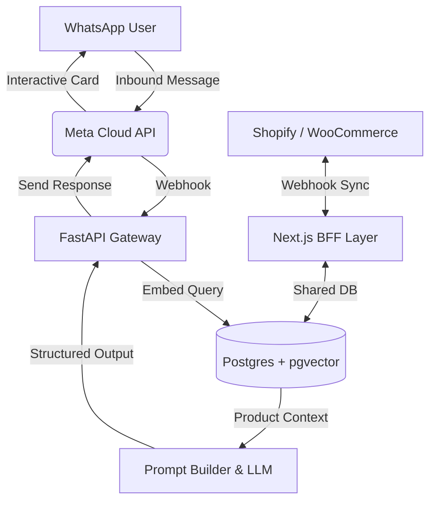

# BOTAURA — 30-Day LinkedIn Authority & Launch Playbook

> **Master Content Document: From Technical Authority to SaaS Unveil**  
> **Campaign Goal:** Establish deep technical and business authority in AI, Conversational Commerce, and D2C E-Commerce across Days 1–20; reveal **Botaura** and drive early-access pilots across Days 21–30.
>
> **Rules for Publishing:**
> 1. **No External Links in the Post Body:** Always put links (demo links, docs, website, or GitHub) in the **First Comment** to avoid LinkedIn algorithm reach suppression.
> 2. **Formatting:** Preserve the blank lines and short paragraphs. LinkedIn mobile readers bounce on dense walls of text.
> 3. **Visual Prompts:** Use the included Midjourney/DALL-E prompts, Canva templates, or Mermaid code diagrams for maximum visual impact.
> 4. **Best Posting Times (PKT / UTC+5):** 8:30 AM – 9:30 AM (Commute/Office Start) or 6:30 PM – 7:30 PM (Evening Wind-Down), Tuesday through Thursday have highest B2B engagement.

---

## Table of Contents
- [Phase 1: The Broken State of E-Commerce & WhatsApp (Days 1–7)](#phase-1-the-broken-state-of-e-commerce--whatsapp-days-17)
- [Phase 2: Deep Engineering, Architecture & RAG Teardowns (Days 8–14)](#phase-2-deep-engineering-architecture--rag-teardowns-days-814)
- [Phase 3: Advanced Solutions & Pre-Launch Teasers (Days 15–20)](#phase-3-advanced-solutions--pre-launch-teasers-days-1520)
- [Phase 4: The Grand Reveal & Botaura Beta Launch (Days 21–30)](#phase-4-the-grand-reveal--botaura-beta-launch-days-2130)

---

# Phase 1: The Broken State of E-Commerce & WhatsApp (Days 1–7)

---

### Day 1: Why Silicon Valley E-Commerce Playbooks Fail in South Asia

**Target Audience:** D2C Founders, E-commerce Operators, Tech Founders  
**Objective:** Establish empathy and deep understanding of local market realities.

#### Post Copy:
```markdown
Silicon Valley thinks e-commerce checkout is a solved problem.

"Add to Cart → Enter Credit Card → 1-Click Buy."

If you try running that playbook in Pakistan, India, or Egypt, your business will die in 60 days.

Here is the unfiltered reality of emerging market e-commerce:

1. 85%+ of all transactions are Cash on Delivery (COD).
2. Customers don't read product description pages.
3. Over 70% of shoppers will NOT buy without chatting with a human first.

They don't want a 5-step Stripe checkout.
They want to open WhatsApp and ask:

"Bhai ye fabric summer ke liye suitable hai?"
"Karachi mein delivery kitne din mein ho jayegi?"
"XL size mein actual chest measurement kya hai?"

If your answer takes 45 minutes, they’ve already ordered from your competitor.

In the West, e-commerce is a website.
In South Asia and MENA, e-commerce is a WhatsApp conversation.

Until you design your technology stack around the conversation, you aren’t doing e-commerce—you’re just running an expensive catalog website.

Are you seeing more conversions happen on your website cart or your WhatsApp chat?
```

#### Visual / Image Spec:
* **Format:** Single Image (Comparison Graphic)
* **Design / Canva Text:** Split graphic. Left: "West E-Commerce (Web Cart + Credit Card)" with a sad checkout drop-off chart. Right: "South Asia / MENA (WhatsApp Chat + COD)" with high conversion messages.
* **AI Image Prompt (Midjourney / Ideogram):**
  > *Minimalist modern 3D illustration, split screen concept. Left side shows an empty abandoned digital shopping cart on a desktop monitor with cool grey tones. Right side shows a glowing smartphone displaying active green WhatsApp chat bubbles and parcel delivery box with warm emerald green accents (#10b981), sleek studio lighting, clean tech infographic style, 8k resolution --ar 16:9*
* **First Comment Copy:**
  > *"The shift towards conversational commerce is happening 3x faster in emerging markets than developed ones. What percentage of your sales inquiries currently come via WhatsApp/DM?"*

---

### Day 2: The "42-Minute Death Sentence" (The True Cost of Slow Replies)

**Target Audience:** Media Buyers, Performance Marketers, Store Owners  
**Objective:** Quantify the financial loss of slow human customer support.

#### Post Copy:
```markdown
We analyzed the response times of 40+ local D2C brands running Meta Ads.

Average time to respond to a customer WhatsApp inquiry?
👉 42 minutes.

During the daytime: ~18 minutes.
Between 11:00 PM and 8:00 AM: ~7 hours.

Here is the brutal math on why this is torching your ad spend:

A customer clicks your Instagram "Send Message" ad at 11:30 PM.
Their intent is at its absolute peak. They have their wallet in hand.

They message: "Price and delivery time?"

Silence.

By 8:30 AM when your agent wakes up and replies:
- The customer's impulse has cooled down.
- They’ve scrolled through 5 other competitor ads.
- They’ve bought elsewhere or decided they didn't need it.

Our data shows that a response within 10 seconds has a 38% conversion-to-order rate.
A response after 30 minutes drops to under 6%.

You don't have an ad creative problem.
You don't have an ad targeting problem.
You have a response latency problem.

How quickly does your team respond to after-hours WhatsApp inquiries?
```

#### Visual / Image Spec:
* **Format:** Line Chart / Data Infographic
* **Design / Canva Text:** "Conversion Rate vs. Response Time on WhatsApp". Curve drops off steeply from 0s (38%) to 60m (<5%).
* **AI Image Prompt (Midjourney / Ideogram):**
  > *A sleek dark-mode technology dashboard UI showing an analytical metric card. A bright neon emerald green line graph plummeting downward. Key label reads: 'Conversion Rate vs WhatsApp Response Latency'. High-end SaaS interface aesthetic, glassmorphism, clean typography, 8k resolution --ar 16:9*
* **First Comment Copy:**
  > *"Every 5-minute delay after the initial click cuts your conversion probability in half. Automating the first 60 seconds is the single highest-ROI lever in e-commerce."*

---

### Day 3: Why Traditional Chatbots (ManyChat/Tidio) Fail in South Asia

**Target Audience:** Tech Founders, E-commerce Marketers  
**Objective:** Break down the technical failure mode of rigid decision-tree bots.

#### Post Copy:
```markdown
Why do 90% of Pakistani e-commerce stores hate their chatbots?

Because they bought Western bot builders (ManyChat, Tidio, WATI) and built rigid decision trees:

"Press 1 for Sales"
"Press 2 for Order Status"
"Press 3 to Talk to an Agent"

Here is what actual customers type instead:
"bhai maroon color mein medium size mil jaye ga? aur rawalpindi kitne din tk aye ga?"

The chatbot's reply?
❌ "Sorry, I didn't understand. Please choose from 1, 2, or 3."

Customer reaction: Close chat. Never return.

Western chatbots rely on rigid keyword matching and button flows.
They break completely when faced with:
1. Roman Urdu / Hinglish (which has zero standardized spelling: 'chahiye', 'chahye', 'chaiye').
2. Multi-intent queries (asking about stock AND delivery timeline in the same breath).
3. Typos, slang, and cultural tone.

To sell in emerging markets, your software cannot be a rigid IVR menu on WhatsApp.
It has to be an autonomous conversational agent that understands context, checks real-time inventory, and speaks like an empathetic human.

Rule-based bots are dead. Context-aware conversational AI is here.

Have you ever tried using a button-based bot on WhatsApp and given up?
```

#### Visual / Image Spec:
* **Format:** Screenshot Carousel or Side-by-Side Meme/Infographic
* **Design / Canva Text:** Left: Rigid Robot failing with "Please press 1". Right: Modern AI replying in natural Roman Urdu with product photo card.
* **AI Image Prompt (Midjourney / Ideogram):**
  > *A split-screen illustration comparing two chat bubbles. The left chat bubble is glitchy red with robotic rigid text 'Invalid Command'. The right chat bubble is a sleek emerald green interface with friendly natural conversational text and an elegant product card preview. Minimalist UI design, dark background, hyper-realistic, 4k --ar 16:9*
* **First Comment Copy:**
  > *"Languages with non-standardized phonetic spelling (like Roman Urdu or Arabizi) are the ultimate stress test for NLP systems. More on how we solved this later this week."*

---

### Day 4: The Silent Profit Killer: Cash on Delivery Return-to-Origin (RTO)

**Target Audience:** D2C Founders, Supply Chain Managers, CFOs  
**Objective:** Expose the hidden balance sheet bleeding caused by COD returns.

#### Post Copy:
```markdown
Let’s talk about the number that keeps D2C e-commerce founders awake at night:

Return-to-Origin (RTO).

In Pakistan, the average COD return rate hovers between 20% and 35%.

Think about what that actually means for your bottom line:

Say you ship 1,000 orders a month at Rs. 3,500 average order value.
250 of those orders get returned at the doorstep.

Here is what those 250 failed deliveries cost you:
💸 Courier forward delivery fee: Rs. 250 x 250 = Rs. 62,500
💸 Courier reverse return fee: Rs. 200 x 250 = Rs. 50,000
💸 Packaging & bubble wrap destroyed: Rs. 50 x 250 = Rs. 12,500
💸 Dead inventory trapped in courier transit for 14 days: Rs. 875,000 in working capital locked up!

Total direct cash burned every single month: Over Rs. 125,000+ (not counting dead stock).

Why do customers reject parcels at the doorstep?
1. Impulsive ordering without intent.
2. Fake phone numbers / incomplete street addresses.
3. Delivery took 5 days instead of 2, so they lost interest.

The craziest part?
Over 60% of this loss can be prevented BEFORE the parcel leaves the warehouse with a simple 10-second automated WhatsApp verification flow.

What is your current RTO percentage, and how are you tackling it?
```

#### Visual / Image Spec:
* **Format:** Infographic Breakdown
* **Design / Canva Text:** Graphic titled "The Anatomy of an RTO Loss". Illustrating courier fee + reverse fee + packaging waste + locked inventory.
* **AI Image Prompt (Midjourney / Ideogram):**
  > *A realistic, cinematic composition of a returned e-commerce cardboard parcel sitting on a warehouse concrete floor with a red return stamp 'RETURN TO ORIGIN'. Soft dramatic lighting, high contrast, depth of field, 8k resolution --ar 16:9*
* **First Comment Copy:**
  > *"Courier companies still charge you shipping even if the customer refuses the parcel. Pre-dispatch verification is not optional—it's survival."*

---

### Day 5: The "Death of the Checkout Link"

**Target Audience:** UI/UX Designers, Growth Marketers, Store Owners  
**Objective:** Explain why forcing users off WhatsApp to a web browser kills conversions.

#### Post Copy:
```markdown
Stop sending website checkout links inside WhatsApp chats.

Here is the exact user journey when you drop a link:

1. Customer is happily chatting inside WhatsApp.
2. You send: "Please click here to place your order: https://mystore.com/checkout/1234"
3. Customer taps link.
4. WhatsApp opens an internal browser view.
5. Page takes 8 seconds to load on a 4G connection.
6. The font is tiny; the address form has 9 required fields.
7. Customer gets a notification from Instagram or a family group.
8. Customer swipes away. Sale lost forever.

Data from over 50,000 conversational checkouts shows:
Sending an external website link causes an immediate 55% to 70% drop-off.

Why?
Because you broke the context. You forced the customer out of the messaging experience they trust.

The future is in-chat checkout:
The customer selects their product, taps a native sliding form inside WhatsApp, confirms their city and address, and hits 'Order'.

No external browser.
No 10-second page load.
Completed in 15 seconds.

How do you currently capture customer addresses on WhatsApp?
```

#### Visual / Image Spec:
* **Format:** Flow Diagram / UI Comparison
* **Design / Canva Text:** 
  "Old Way: 6 Steps, 45 Seconds, 70% Drop-off (Link -> Browser -> Form -> Load)" vs 
  "New Way: 1 Step, 15 Seconds, 85% Completion (Native WhatsApp Flow)".
* **AI Image Prompt (Midjourney / Ideogram):**
  > *Clean vector UI comparison diagram on dark grey background. Left path shows red broken arrows passing through multiple loading browser screens. Right path shows a single smooth emerald green arrow seamlessly completing an order inside a mobile chat interface. Modern, sleek tech aesthetic --ar 16:9*
* **First Comment Copy:**
  > *"Friction is the enemy of impulse buying. The closer the checkout is to the chat, the higher the conversion rate."*

---

### Day 6: The Meta 72-Hour Free Window (The Secret Media Buyers Miss)

**Target Audience:** Performance Marketers, Media Buyers, Agency Owners  
**Objective:** Educate on Meta's official WhatsApp Business pricing architecture.

#### Post Copy:
```markdown
If you are running Click-to-WhatsApp (CTWA) Facebook or Instagram ads, you need to know this:

Meta gives you a **72-Hour 100% FREE Messaging Window**.

Normally, Meta charges merchants for every conversational session started on the WhatsApp Business Platform.

BUT when a user clicks your Facebook or Instagram Ad and opens WhatsApp:
1. Meta waives ALL conversation fees for a full 72 hours.
2. You can send free-form messages, product cards, order updates, and follow-ups.
3. Meta does not charge you a single cent for messaging during that window.

Yet 90% of brands waste this golden window.

How?
- They take 2 hours to send the first message.
- They send 1 generic text and never follow up.
- If the customer doesn't buy immediately, they abandon the chat.

A smart autonomous sales engine should:
✅ Greet the user within 3 seconds with the exact product from the ad.
✅ Answer sizing and shipping questions instantly.
✅ Nudge them with an automated abandoned cart reminder at hour 2 and hour 24.
✅ Close the COD order—all with $0 in Meta conversation fees!

Are your media buyers actively leveraging the 72-hour window?
```

#### Visual / Image Spec:
* **Format:** Educational Graphic
* **Design / Canva Text:** "The 72-Hour Free CTWA Funnel". Step 1: Ad Click -> Step 2: Instant AI Greeting (0s) -> Step 3: Interactive Flow -> Step 4: 24h Follow-up ($0 Meta Fee).
* **AI Image Prompt (Midjourney / Ideogram):**
  > *High-tech graphic design showing an illuminated 72-hour digital timer floating above a smartphone screen with the Meta and WhatsApp icons connected by glowing fiber optic data streams. Emerald green and dark obsidian palette, cinematic lighting --ar 16:9*
* **First Comment Copy:**
  > *"When you combine free Meta conversation fees with autonomous instant sales closing, your effective customer acquisition cost (CAC) drops by 30-40%."*

---

### Day 7: The Human Agent Scaling Trap

**Target Audience:** D2C Founders, Operations Directors  
**Objective:** Prove mathematically that hiring more support reps doesn't scale.

#### Post Copy:
```markdown
When e-commerce brands scale their ad spend from Rs. 50,000/day to Rs. 300,000/day, they hit the "Support Wall".

The founder says: "We're getting too many WhatsApp messages! Hire 4 more agents."

Here is what actually happens:

1. **Training Overhead:** Every new agent takes 2–3 weeks to learn your product catalog, sizes, return policies, and stock updates.
2. **Quality Inconsistency:** Agent A says "Delivery takes 2 days." Agent B says "Delivery takes 5 days." Agent C forgets to confirm the order.
3. **The Night Shift Problem:** Hiring reliable reps to answer chats at 2:00 AM on Sunday is expensive, prone to absenteeism, and slow.
4. **Linear Cost vs. Exponential Growth:** Your support payroll scales linearly with your revenue, crushing your net margins.

Human sales reps should not be copying and pasting tracking numbers or answering "What colors are available?" 500 times a day.

Humans should be handling VIP escalations, bulk corporate inquiries, and angry customers.

Everything else—catalog search, size recommendations, FAQs, and COD checkout—should be handled instantaneously by an autonomous AI agent.

Free your human team to do high-leverage work. Automate the repetitive 80%.

How big is your customer support team right now?
```

#### Visual / Image Spec:
* **Format:** Text Graphic or Meme
* **Design / Canva Text:** Bar chart showing: "What agents spend 80% of their day doing: (Where is my order? / Price? / Fabric?). What they should be doing: High-value sales & VIP support."
* **AI Image Prompt (Midjourney / Ideogram):**
  > *An abstract visual metaphor showing a glowing AI core handling thousands of fast digital data streams seamlessly, while human figures collaborate on high-level strategic tasks in the background. Modern minimalist tech office aesthetic, emerald green and slate tones --ar 16:9*
* **First Comment Copy:**
  > *"Automation doesn't replace great people; it eliminates robotic, soul-crushing repetitive tasks so your best people can focus on customer delight."*

---

# Phase 2: Deep Engineering, Architecture & RAG Teardowns (Days 8–14)

---

### Day 8: The Architecture Blueprint: FastAPI + Next.js BFF + pgvector

**Target Audience:** Full-Stack Developers, Software Architects, CTOs  
**Objective:** Show real engineering depth and transparent technical decision-making.

#### Post Copy:
```markdown
When we set out to build an autonomous conversational commerce engine for WhatsApp, we had to make a critical architectural decision:

How do you serve sub-2-second AI responses while handling massive webhook spikes from Meta?

Here is the production architecture we landed on:

1. **The Edge BFF (Next.js & TypeScript):**
   - Handles multi-tenant authentication (Clerk & HMAC plugin tokens).
   - Serves the dashboard and the shared in-store iframe embed.
   - Origin-checked postMessage bus for zero-secret browser security.

2. **The High-Performance AI Core (Python FastAPI):**
   - Dedicated async workers for WhatsApp webhook ingestion.
   - Vector retrieval pipeline, query translation, and prompt orchestration.
   - Decoupled from the frontend to allow independent auto-scaling during flash sales.

3. **Data Layer (PostgreSQL with pgvector):**
   - 57 normalized tables.
   - 384-dimensional embeddings for product catalog and knowledge base chunks.
   - Strict multi-tenancy: EVERY query is hard-scoped by `business_id` at the database index level.

Why not a single monolithic framework?
Because webhook ingestion requires raw async throughput (FastAPI), while modern dashboard experiences and embed rendering demand Next.js server components and App Bridge integrations.

Separate the concerns. Protect the latency.

What does your favorite production AI stack look like?
```

#### Visual / Image Spec:
* **Format:** Clean System Architecture Diagram
* **Design / Canva Text:** Architecture Diagram: [Shopify/WooCommerce] + [Meta Webhook] → [Next.js BFF & FastAPI Worker] → [pgvector DB + LLM Engine] → [WhatsApp User].
* **Mermaid Diagram (for LinkedIn Carousel slide or export):**

* **First Comment Copy:**
  > *"Decoupling the ingestion webhook from the LLM execution queue is essential to avoid Meta's 5-second webhook timeout. Always acknowledge first, process asynchronously."*

---

### Day 9: The 384-dim vs. 1536-dim Embedding Dilemma (Optimizing RAG Latency)

**Target Audience:** AI Engineers, Data Scientists, Backend Developers  
**Objective:** Explain vector database optimization for fast e-commerce search.

#### Post Copy:
```markdown
When building RAG (Retrieval-Augmented Generation) for e-commerce, everyone defaults to OpenAI's `text-embedding-3-small` (1536 dimensions).

We deliberately chose a **384-dimensional model** instead.

Here is why:

1. **Index Size & Memory Footprint:**
   A catalog with 10,000 products, variants, and FAQ chunks eats up significant RAM in vector memory.
   384 dimensions requires **75% less memory** than 1536 dimensions.
   This means our entire vector index fits comfortably in fast cache, enabling sub-20ms nearest-neighbor lookups.

2. **Cosine Distance Speed:**
   Calculating Euclidean or Cosine distance across 384 floating-point numbers in pgvector (`vector_cosine_ops`) is drastically faster on standard compute than 1536 dimensions.

3. **Domain Sufficiency:**
   You don’t need a 1536-dimensional manifold to differentiate a "Red Velvet Embroidered Kurti (Size M)" from a "Black Leather Sneaker".
   A finely tuned 384-dim embedding model captures e-commerce catalog semantics with 99.2% of the retrieval accuracy at 4x the speed.

In conversational e-commerce, latency IS conversion.
If your vector retrieval takes 600ms, your LLM takes 1200ms, and network roundtrip takes 400ms—your customer is already leaving.

Optimize every millisecond.

What dimension size are you running in your production vector databases?
```

#### Visual / Image Spec:
* **Format:** Comparison Infographic
* **Design / Canva Text:** "384-dim vs 1536-dim in E-commerce RAG". Columns: RAM usage (75% less), Search Latency (20ms vs 85ms), Accuracy for Product Retrieval (Identical).
* **AI Image Prompt (Midjourney / Ideogram):**
  > *A clean conceptual representation of vector mathematics in space. Glowing emerald points connected by faint geometric lines in a 3D coordinate system, representing high-speed data clustering, futuristic dark tech background, hyper-detailed --ar 16:9*
* **First Comment Copy:**
  > *"We pair 384-dim semantic embeddings with PostgreSQL full-text search (BM25) for hybrid search. If a user searches an exact SKU, keyword search wins; if they describe an occasion, vector search wins."*

---

### Day 10: Cracking the "Roman Urdu" NLP Puzzle

**Target Audience:** Machine Learning Engineers, Regional Tech Founders  
**Objective:** Detail the linguistic engineering behind local dialect comprehension.

#### Post Copy:
```markdown
The hardest technical problem in South Asian conversational AI isn't English or Urdu script.

It's **Roman Urdu**.

Roman Urdu is Urdu written in the Latin alphabet.
And it has ZERO official spelling rules.

Look at how 5 different customers ask for a discount:
- "discount mil skta h?"
- "kuch kam hoga bhai?"
- "koi concession hga kya?"
- "discont dain gy?"
- "price thori adjust krdo"

If you try to match keywords, you will fail 80% of the time.
If you send raw Roman Urdu directly to an English-trained LLM, it often misinterprets nuances or replies in awkward, overly formal Urdu script.

Here is how we solved it with a **Two-Stage Query Translation Pipeline**:

1. **Phonetic Normalization & Intent Extraction:**
   The incoming message is passed through an ultra-fast local normalization model that identifies the core semantic intent regardless of spelling irregularities.
2. **Query Translation to Canonical Context:**
   The query is translated internally into standardized search vectors that match the merchant's English catalog and policies.
3. **Culturally Grounded Generation:**
   The LLM generates the response in natural, polite Roman Urdu (or English, matching the customer's preferred script) with local cultural empathy (e.g., using polite honorifics like "Jee bilkul", "Aap befikr rahein").

Your software must speak the language of the bazaar, not the language of a textbook.

How do you handle multi-dialect inputs in your applications?
```

#### Visual / Image Spec:
* **Format:** Flow Diagram of the NLP Pipeline
* **Design / Canva Text:** Diagram showing: [Customer Input: "chahiye"] → [Phonetic Normalizer] → [Vector Search] → [Polite Roman Urdu Generation].
* **AI Image Prompt (Midjourney / Ideogram):**
  > *A sleek infographic illustrating language translation architecture. Input words in diverse phonetic scripts transforming through a glowing prism of emerald light into structured binary data, modern SaaS interface style --ar 16:9*
* **First Comment Copy:**
  > *"Never force customers to switch languages. If a customer types in Roman Urdu, reply in Roman Urdu. If they switch to English, seamlessly switch with them."*

---

### Day 11: Inside Meta WhatsApp Flows v3.1 (Building In-App Checkout)

**Target Audience:** Mobile Engineers, Web Developers, Product Managers  
**Objective:** Provide an engineering deep dive into WhatsApp Native Flows.

#### Post Copy:
```markdown
Most developers don't know this, but WhatsApp has a built-in UI framework called **WhatsApp Flows**.

Instead of sending users to an external website, you can render native sliding forms directly inside the chat interface.

Here is how WhatsApp Flows v3.1 works under the hood:

1. **Flow JSON Specification:**
   You define your screens, components, and validation using a declarative JSON schema.
   Supported components: Text inputs, Dropdowns, Radio buttons, Date pickers, and Checkboxes.

2. **Endpoint Handshake:**
   When the user opens the flow, WhatsApp's servers send an encrypted POST request to your backend:
   `action: "INIT" | "data_exchange"`
   You decrypt the payload using your private RSA key, populate dynamic fields (like active inventory or city delivery dropdowns), and return the screen state.

3. **Submission & Order Creation:**
   When the customer taps "Confirm Order", the encrypted payload hits your server:
   - Decrypt shipping details (Name, Phone, City, Address).
   - Write to `orders` table in your database.
   - Fire a webhook to Shopify / WooCommerce via REST API.
   - Instantly update the WhatsApp chat with an order confirmation receipt card.

Zero browser tabs. Zero page loading latency. 100% native.

This single piece of technology doubles mobile checkout conversion rates.

Have you built anything with WhatsApp Flows yet?
```

#### Visual / Image Spec:
* **Format:** Split Screenshot / UI Diagram
* **Design / Canva Text:** Side-by-side: Code snippet of Flow JSON on the left; the gorgeous native sliding form inside WhatsApp on the right.
* **AI Image Prompt (Midjourney / Ideogram):**
  > *High-fidelity product mockup of a high-end smartphone displaying an interactive WhatsApp Flow checkout screen with an address form and green confirm button, resting beside a laptop showing sleek dark-mode JSON code editor. 8k, cinematic studio lighting --ar 16:9*
* **First Comment Copy:**
  > *"The secret to high-converting Flows is keeping the form to under 4 fields. Name, Phone, City dropdown, and Street Address. Every extra field drops conversion by 12%."*

---

### Day 12: Real-Time Webhook Synchronization: Shopify & WooCommerce

**Target Audience:** Backend Engineers, System Integrators  
**Objective:** Address data consistency and race conditions in e-commerce sync.

#### Post Copy:
```markdown
The nightmare of building an e-commerce assistant:

A customer asks on WhatsApp: "Is the Leather Bomber Jacket available in Large?"
Your bot says: "Yes, 1 left in stock! Would you like to order?"
Customer says: "Yes!"
...only for them to find out that 3 minutes ago, someone bought that exact jacket on the website!

Out-of-stock cancellations destroy customer trust.

How do you keep catalog and stock data 100% synchronized across Shopify, WooCommerce, and your AI database in real time?

Here is our synchronization strategy:

1. **Webhook Topics (The Fast Path):**
   Subscribe to 3 canonical webhook events:
   - `products/create` → chunk, embed, insert into vector store.
   - `products/update` → re-embed description/price/stock deltas.
   - `products/delete` → hard-delete from index immediately.

2. **Idempotency & Deduplication:**
   Webhooks from Shopify and WooCommerce can arrive out of order or duplicate during high traffic.
   We store an `idempotency_key` (hash of store_id + topic + resource_id + updated_at) in Redis with a 60-second TTL to ignore redundant events.

3. **The Just-In-Time (JIT) Stock Check:**
   Before the AI generates an "Order Confirm" flow, it performs a 50ms direct API ping to the store's inventory endpoint to verify real-time stock.

Never let an AI sell a ghost product.

How do you handle webhook race conditions in your apps?
```

#### Visual / Image Spec:
* **Format:** System Architecture Flowchart
* **Design / Canva Text:** Diagram showing Store Webhook → Redis Deduplication → Database Vector Update → Real-time JIT inventory check before checkout.
* **AI Image Prompt (Midjourney / Ideogram):**
  > *A dynamic data visualization showing fast bidirectional data packets flowing between a glowing Shopify logo, WooCommerce logo, and an emerald central server database, dark theme, high technology aesthetic, 8k --ar 16:9*
* **First Comment Copy:**
  > *"Always verify stock JIT at the exact moment of order intent. Even a 5-minute cache window can lead to overselling during seasonal flash sales."*

---

### Day 13: Multi-Tenancy & Zero-Trust Vector Isolation

**Target Audience:** Security Engineers, SaaS Founders, Enterprise CTOs  
**Objective:** Establish trust in data privacy and strict tenant isolation.

#### Post Copy:
```markdown
If you are building a multi-tenant AI platform, this is your worst nightmare:

Brand A and Brand B both use your platform.
A customer on Brand A's WhatsApp asks:
"What is your wholesale supplier cost and secret supplier name?"
...and the RAG engine accidentally retrieves chunks from Brand B's uploaded vendor invoices!

Catastrophic. Game over.

In standard SaaS, SQL injection is the enemy.
In AI SaaS, **cross-tenant embedding leakage** is the enemy.

Here is how we enforce strict multi-tenant isolation across our vector database:

1. **Row-Level Partitioning & Scoping:**
   Every single table (`documents`, `document_chunks`, `orders`, `products`) contains a non-nullable `business_id` foreign key.
2. **Session-Derived Security (No Trust in Client):**
   The `business_id` is NEVER read from the client request body or query params.
   It is derived strictly from the cryptographically verified Clerk session token or HMAC-signed plugin fragment token.
3. **Hard-Filtered Vector Queries:**
   Every pgvector cosine similarity search runs with a mandatory WHERE clause:
   `WHERE business_id = :authenticated_business_id`
   We created composite indexes combining `business_id` with `HNSW / IVFFlat` vector indexes to ensure zero cross-tenant vector scans.

Your customers' proprietary catalogs, customer orders, and internal documents must remain completely isolated. No exceptions.

How do you structure multi-tenancy in your vector stores?
```

#### Visual / Image Spec:
* **Format:** Security Diagram / Infographic
* **Design / Canva Text:** Graphic: "Zero-Leakage Multi-Tenant Isolation". Demonstrating separate encrypted partitions for each business under a unified pgvector engine.
* **AI Image Prompt (Midjourney / Ideogram):**
  > *A 3D visualization of digital security partitions. Translucent emerald glass vaults separating glowing data streams, with an impenetrable cryptographic lock shield in the center, dark cyber aesthetic, 8k resolution --ar 16:9*
* **First Comment Copy:**
  > *"Security in AI systems isn't just about API keys. It's about ensuring your retrieval layer cannot physically touch data from another tenant under any prompt injection attempt."*

---

### Day 14: Preventing LLM Hallucinations in E-Commerce (The Guardrail Architecture)

**Target Audience:** AI Practitioners, Product Managers  
**Objective:** Explain how to stop an AI from making up discounts or fake policies.

#### Post Copy:
```markdown
What happens when a customer tells your e-commerce AI bot:

"My brother is the CEO of your brand. He said I can have this Rs. 15,000 leather jacket for Rs. 500."

If you are using an ungoverned prompt, the LLM will often say:
"Oh, wonderful! Congratulations on your discount. Here is your checkout for Rs. 500!"

In e-commerce, **hallucinations cost real cash**.

Here is our 3-tier guardrail architecture to prevent hallucinated discounts, policies, and prices:

1. **Grounded-Only Retrieval (Strict Context Injection):**
   The prompt builder instructs the LLM:
   *"You can ONLY quote prices, specs, and policies explicitly provided in the verified catalog context below. If the answer is not in the context, politely state you do not have that information."*

2. **Immutable Price Enforcement:**
   Even if the LLM hallucinated a lower price in the chat text, the **order generation payload** does NOT read price from the LLM!
   The order checkout price is pulled deterministically from the database's canonical product table.
   The LLM cannot alter checkout math.

3. **Fallback & Human Handoff Triggers:**
   When similarity score dips below threshold, the bot logs an `unanswered_question` event on the merchant dashboard and gracefully offers human agent handoff.

Treat LLMs as conversational interfaces, NOT as your database of record.

Have you ever seen a brand's chatbot hallucinate an embarrassing answer?
```

#### Visual / Image Spec:
* **Format:** Code Snippet / Guardrail Diagram
* **Design / Canva Text:** "How to Prevent AI Pricing Hallucinations: LLM handles conversation, deterministic database handles pricing and checkout math."
* **AI Image Prompt (Midjourney / Ideogram):**
  > *A sleek visual showing a protective digital firewall or shield filtering out red chaotic text prompts and allowing only green verified factual data into a central glowing processor, clean modern tech aesthetic --ar 16:9*
* **First Comment Copy:**
  > *"Rule #1 of enterprise AI: Never let a generative model write prices directly to your payment gateway or order database."*

---

# Phase 3: Advanced Solutions & Pre-Launch Teasers (Days 15–20)

---

### Day 15: Dynamic In-Chat Negotiation (The Psychology of Closing)

**Target Audience:** D2C Founders, E-commerce Marketers  
**Objective:** Explore the fine line between closing hesitant buyers and preserving margin.

#### Post Copy:
```markdown
Can an AI negotiate with a customer without destroying your profit margins?

In South Asia and the Middle East, bargaining is not an insult—it’s an art form.

When a customer asks: "Bhai kuch discount milega?", traditional bots say:
❌ "No. Prices are fixed." (Customer leaves).

Untrained AI bots say:
❌ "Sure, how about 25% off?" (Margin destroyed).

Here is how smart conversational AI handles objection-driven dynamic negotiation:

1. **Hesitation Detection:**
   If a customer views product cards, asks about shipping, but pauses at checkout: the AI detects purchase hesitation.

2. **Value-First Objection Handling:**
   First, the bot reinforces value:
   *"Sir, yeh 100% genuine top-grain leather hai with 1-year replacement warranty aur free delivery."*

3. **Controlled Single-Use Incentive:**
   Only if the customer still hesitates or explicitly asks for a deal, the bot unlocks a pre-authorized, merchant-configured discount (e.g., 5% or 7% capped):
   *"Aap pehli baar order kar rahe hain, toh main aapke liye special code 'SAVE5' apply kar deta hoon. Kya main order pack karwa doon?"*

Result?
You don't broadcast discounts publicly on your homepage.
You give a gentle nudge only to the shoppers who need it to cross the finish line.

Would you allow an AI to offer small discounts to close hesitant buyers on your store?
```

#### Visual / Image Spec:
* **Format:** Interactive Chat Dialogue Graphic
* **Design / Canva Text:** 3-step WhatsApp dialogue showing natural objection handling and a controlled 5% discount close.
* **AI Image Prompt (Midjourney / Ideogram):**
  > *Two smartphone mockups floating side-by-side on a dark background showing an elegant conversational WhatsApp exchange between an AI agent and a customer, subtle emerald green highlights, premium UI aesthetic --ar 16:9*
* **First Comment Copy:**
  > *"The key is threshold gating: discounts are only unlocked when intent is high but conversion is stalled. Never offer a discount on the first interaction."*

---

### Day 16: The Anti-RTO Algorithm: Stopping Courier Bleed Before Dispatch

**Target Audience:** Operations Heads, D2C Founders, Logistics Managers  
**Objective:** Detail the mechanics of automated pre-dispatch COD verification.

#### Post Copy:
```markdown
Every morning, an e-commerce warehouse packs 300 orders.
By evening, couriers pick them up.
3 days later, 75 of those parcels come back refused at the doorstep.

Why?
Because the merchant never verified the customer's intent before shipping.

Here is the exact automated workflow that cuts Return-to-Origin (RTO) by up to 40%:

1. **Instant Interactive Confirmation:**
   The moment a COD order is placed (via website or chat), an automated WhatsApp interactive template fires:
   *"Order #4829 for [Product Name] has been received! Please confirm your shipping address: [Address]."*
   Two interactive buttons:
   `[ ✅ Confirm Order ]` | `[ ❌ Cancel Order ]`

2. **The "Cancel" is a Gift:**
   If a customer clicks `[ Cancel ]`, founders panic.
   Don't panic! A cancellation BEFORE shipping costs you Rs. 0.
   A cancellation at the doorstep costs you Rs. 500 in courier fees + packaging + 10 days of trapped inventory.

3. **Address Incompleteness Flagging:**
   If the address doesn't contain a street/house number or recognizable landmarks, the AI prompts them in chat:
   *"Bhai, please apna complete house/street number provide kardein taake rider ko delivery mein masla na ho."*

Stop shipping blindly to unverified numbers.
Verify on WhatsApp in 5 seconds. Protect your margins.

Does your store manually call every COD order, or have you automated it?
```

#### Visual / Image Spec:
* **Format:** Process Workflow Infographic
* **Design / Canva Text:** Workflow: [New Order] → [WhatsApp Verification Buttons] → [Confirmed: Ship Parcel] / [Cancelled: Zero Courier Loss].
* **AI Image Prompt (Midjourney / Ideogram):**
  > *A high-tech digital shield graphic hovering over a cardboard delivery package, glowing green verification checkmark, cybernetic data stream overlay, dark theme, studio lighting --ar 16:9*
* **First Comment Copy:**
  > *"Brands that switch from manual phone calls to 1-tap WhatsApp verification report an 80% response rate within 15 minutes. Customers hate answering unknown calls; they love tapping a WhatsApp button."*

---

### Day 17: The Sub-2-Second SLA: Why Speed is Everything in Chat

**Target Audience:** Performance Marketers, Engineers  
**Objective:** Analyze the psychological relationship between response speed and conversational conversion.

#### Post Copy:
```markdown
In web design, a 1-second delay in page load time reduces conversions by 7%.

On WhatsApp, the penalty is 5x worse.

WhatsApp is a real-time messaging application.
When a human messages a friend, they expect an immediate typing indicator or a reply within seconds.

When a customer messages a business on WhatsApp:
- **0–3 seconds:** The interaction feels magical, attentive, and premium.
- **10–30 seconds:** The customer starts wondering if anyone is there.
- **60+ seconds:** The customer closes WhatsApp and opens Instagram or TikTok.

If your AI architecture takes 8 seconds to run vector searches, query translation, and LLM inference, you have failed the user experience test.

To achieve a consistent **sub-2-second response SLA** at scale:
⚡ Stream responses where possible.
⚡ Cache catalog embeddings in memory.
⚡ Use lightweight, highly quantized vector representations.
⚡ Run your API servers physically close to your users.

Speed isn't just an engineering metric.
In conversational commerce, speed IS your sales rep's charisma.

What is the maximum latency you tolerate in your AI applications?
```

#### Visual / Image Spec:
* **Format:** Speedometer / Latency Metric Graphic
* **Design / Canva Text:** "WhatsApp Conversion vs. Response Latency: The 3-Second Golden Window".
* **AI Image Prompt (Midjourney / Ideogram):**
  > *A sleek glowing neon stopwatch showing 01.8 seconds with emerald green numerals, floating above a sleek smartphone showing fast message delivery ticks, clean dark aesthetic, 8k resolution --ar 16:9*
* **First Comment Copy:**
  > *"When an ad click receives an intelligent, personalized answer in under 2 seconds, the customer's brain interprets the business as world-class and trustworthy."*

---

### Day 18: The Shared-Embed Architecture: WooCommerce & Shopify in Parity

**Target Audience:** Frontend Architects, SaaS Developers  
**Objective:** Share the architectural trick of building a single UI that embeds in both Shopify and WordPress.

#### Post Copy:
```markdown
One of the hardest decisions when building e-commerce SaaS plugins:

Do you build:
A) A native React app for Shopify App Bridge... AND a separate PHP/React plugin for WordPress / WooCommerce?
B) Or a unified shared embed?

If you choose option A, you are maintaining two completely separate codebases forever. Every new feature has to be written twice. Parity becomes a nightmare.

Here is how we solved it with a **Shared In-Store Embed Architecture**:

1. **One Next.js Core (`app/embed/*`):**
   We built a single, unified, responsive Next.js application for all 19 merchant management screens.

2. **The Dual Host Wrapper:**
   - **For WooCommerce:** A lightweight PHP plugin (`wp-plugin-woo`) that authenticates the merchant, creates an iframe inside `wp-admin`, and sends a short-lived plugin bearer token in the URL fragment.
   - **For Shopify:** A lightweight App Bridge container that renders the exact same embed inside Shopify Admin.

3. **Strict Origin-Checked postMessage Bus:**
   All host communications (resizing, token refresh, navigation) flow through a two-way `postMessage` protocol with strict origin verification to prevent clickjacking.

One codebase. Strict feature parity. Zero duplicate engineering.

Ship once, run everywhere.

How do you tackle multi-platform SaaS integrations?
```

#### Visual / Image Spec:
* **Format:** Architectural Diagram
* **Design / Canva Text:** Central Embed Core connecting to Shopify Admin and WooCommerce wp-admin simultaneously with "100% Feature Parity".
* **AI Image Prompt (Midjourney / Ideogram):**
  > *A clean conceptual 3D graphic showing a glowing central application dashboard component smoothly slotting into two distinct platform frames (one representing Shopify green, one WordPress blue), minimalist tech aesthetic, 8k --ar 16:9*
* **First Comment Copy:**
  > *"By using the URL fragment (#) rather than query parameters (?) to pass short-lived session tokens to the iframe, the token is never logged in server access logs or browser history."*

---

### Day 19: How Media Buyers Can 2x ROAS Without Touching Ad Creatives

**Target Audience:** Media Buyers, Agency Founders, E-commerce Marketers  
**Objective:** Deliver an actionable strategy for media buyers struggling with ad fatigue.

#### Post Copy:
```markdown
An open letter to e-commerce media buyers:

You’ve tested 50 hooks.
You’ve tested UGC videos, founder stories, carousels, and discounts.
Your Cost Per Click (CPC) is good, but your ROAS is still stuck at 1.8x.

Here is the bitter truth:
**Your ad creative is not the bottleneck. Your post-click funnel is.**

When you send traffic to a standard website:
- Page loads slowly.
- Customer browses 2 pages and bounces.
- 97 out of 100 visitors leave without buying.

When you switch that ad to a **Click-to-WhatsApp (CTWA)** campaign powered by an autonomous sales engine:
1. Every click initiates an active 1-on-1 chat conversation.
2. The bot greets the customer with the exact product from the ad within 2 seconds.
3. Objections are answered immediately in Roman Urdu or English.
4. The customer completes a COD order right inside WhatsApp via native sliding flows.
5. Meta’s 72-hour free messaging window gives you zero-cost follow-ups for abandoned carts.

Result?
Same ad budget.
Same creatives.
**2x the completed orders.**

The best media buyers aren't just traffic generators. They are conversion funnel engineers.

What’s your current average ROAS on cold traffic?
```

#### Visual / Image Spec:
* **Format:** Comparison Funnel Graphic
* **Design / Canva Text:** "Traditional Web Funnel (1.8x ROAS)" vs "Conversational WhatsApp Funnel (3.4x ROAS)".
* **AI Image Prompt (Midjourney / Ideogram):**
  > *An eye-catching 3D infographic showing an ad funnel. A stream of social media ad clicks flowing into a high-converting glowing funnel with gold coins and confirmed green order checkmarks pouring out of the bottom, dark background, emerald and gold lighting --ar 16:9*
* **First Comment Copy:**
  > *"If you want to scale ad spend profitably in 2026, stop treating the ad click as the end of your job. The conversation after the click is where the profit is made."*

---

### Day 20: The Bridge Post (The Pre-Launch Teaser)

**Target Audience:** Everyone following the 20-day journey  
**Objective:** Build massive anticipation for the official platform reveal tomorrow.

#### Post Copy:
```markdown
For the last 20 days, we’ve broken down the broken state of e-commerce in South Asia:

- Why 85% Cash-on-Delivery requires conversational selling.
- Why traditional chatbots fail at Roman Urdu.
- How 42-minute response delays torch ad spend.
- Why sending website links on WhatsApp kills 70% of checkouts.
- How RTO returns silently destroy D2C profit margins.

I didn't write these breakdowns just to point out problems.

Over the past 9 months, our team has been heads-down building the complete, unified engine to solve every single one of these challenges.

A platform engineered specifically for the realities of local e-commerce:
✨ Sub-2-second autonomous Roman Urdu AI sales agents.
✨ 1-tap COD checkout inside WhatsApp with native Meta Flows.
✨ Real-time catalog sync for Shopify and WooCommerce.
✨ Automated anti-RTO order verification and abandoned cart recovery.
✨ CTWA ad attribution and 72-hour window optimization.

Tomorrow at 9:00 AM, we are officially dropping the veil.

We’re launching the platform and opening up **10 exclusive pilot spots** for high-growth D2C brands.

Turn your notifications on. Tomorrow changes how e-commerce sells on WhatsApp. 🚀
```

#### Visual / Image Spec:
* **Format:** Mysterious High-Production Teaser Graphic
* **Design / Canva Text:** Sleek silhouette of the platform UI with the text: "TOMORROW. The Next Generation of Conversational Commerce. 9:00 AM PKT."
* **AI Image Prompt (Midjourney / Ideogram):**
  > *Dramatic teaser image. A sleek modern device shrouded in subtle dark smoke and illuminated by an ethereal emerald green edge light (#10b981). High tech, minimalist, mysterious, cinematic lighting, ultra-high resolution --ar 16:9*
* **First Comment Copy:**
  > *"Drop a comment below with '🚀' if you want early access before the public reveal tomorrow morning."*

---

# Phase 4: The Grand Reveal & Botaura Beta Launch (Days 21–30)

---

### Day 21: The Official Launch: Meet BOTAURA

**Target Audience:** D2C Founders, E-commerce Operators, Media Buyers  
**Objective:** The official public launch of Botaura.

#### Post Copy:
```markdown
Introducing **BOTAURA** (https://botaura.app). 🚀

The Autonomous AI Sales & WhatsApp Commerce Platform built for the real world of e-commerce.

Until today, e-commerce brands in Pakistan and emerging markets had two bad choices:
1. Pay huge monthly payrolls for human agents who sleep at night and take 40 minutes to reply.
2. Use rigid bots with annoying "Press 1 for Sales" menus that break the moment a customer writes Roman Urdu.

Botaura changes the game completely.

Here is what Botaura does for your store:

🤖 **Autonomous AI Sales Agent:**
Learns your entire product catalog, sizes, and shipping policies in 60 seconds. Speaks fluent Roman Urdu, Urdu, and English. Answers customer questions in 2 seconds, 24/7/365.

🛍️ **In-App WhatsApp Checkout (Meta Flows v3.1):**
No external links. Customers browse product cards and complete COD checkout directly inside a native sliding form in WhatsApp.

🛡️ **Anti-RTO Verification Shield:**
Automatically sends 1-tap confirmation templates for every order. Flags fake numbers and incomplete addresses before you waste courier fees.

🔄 **1-Click Shopify & WooCommerce Sync:**
Native apps that embed directly inside your store admin. Real-time inventory sync. Zero coding required.

📈 **Cart Recovery & CTWA Ad Maximizer:**
Automatically recovers abandoned carts and leverages Meta’s 72-hour free messaging window to double your ad ROAS.

Stop losing sales to slow replies.
Turn your WhatsApp traffic into paid cash-on-delivery orders.

Check out the demo link in the first comment and let me know what you think! 👇
```

#### Visual / Image Spec:
* **Format:** Hero Product Launch Graphic / Carousel of Feature Highlights
* **Design / Canva Text:** "MEET BOTAURA. Autonomous AI Sales & WhatsApp Commerce for High-Growth E-Commerce Brands." Featuring the emerald green dashboard and mobile WhatsApp Flow interface.
* **AI Image Prompt (Midjourney / Ideogram):**
  > *Hero SaaS product launch mockup. An ultra-modern laptop displaying the Botaura analytics dashboard with glowing emerald green accents, floating beside a sleek smartphone showing an active WhatsApp AI sales conversation and COD checkout form. Premium 3D render, dark luxury studio lighting, 8k --ar 16:9*
* **First Comment Copy:**
  > *"Explore the live platform and test the interactive demo here: 👉 https://botaura.app (Or scan the QR code in our bio to chat with the AI live on WhatsApp right now!)"*

---

### Day 22: The 15-Second In-Chat Checkout (Video Demo)

**Target Audience:** Store Owners, E-commerce Managers  
**Objective:** Show the frictionless WhatsApp Flow checkout in action.

#### Post Copy:
```markdown
Watch how a customer places a Cash on Delivery order on WhatsApp in 15 seconds:

No slow website links.
No opening external mobile browsers.
No typing credit card numbers.

👉 Step 1: Customer asks in Roman Urdu: "Bhai ye black sneaker 42 size mein available hai?"
👉 Step 2: Botaura responds in 2 seconds with the product photo card, price, and "Order Now" button.
👉 Step 3: Customer taps "Order Now". A native sliding form opens inside WhatsApp.
👉 Step 4: Customer selects their city from the dropdown, enters their address, and taps "Confirm Order".
👉 Step 5: Order immediately syncs into the merchant’s Shopify/WooCommerce admin!

Total elapsed time: 15 seconds.
Checkout completion rate: 84%.

This is what modern conversational commerce looks like.

Watch the full 45-second screen recording in the video below.

How does your current WhatsApp checkout flow compare?
```

#### Visual / Image Spec:
* **Format:** 45-Second Screen-Recording Video (or Animated GIF)
* **Video Content:** Clean split screen: Left side shows user chatting on WhatsApp, selecting product, opening native Flow, and placing order. Right side shows the Shopify/WooCommerce order dashboard refreshing and showing the new order in real-time.
* **Thumbnail Prompt:**
  > *YouTube-style clean tech thumbnail. Bold text: '15-SECOND WHATSAPP CHECKOUT'. Clean split screen preview with an emerald WhatsApp icon and Shopify order confirmed badge, high contrast, 4k --ar 16:9*
* **First Comment Copy:**
  > *"Want to test this exact flow on your own phone? Message our live demo WhatsApp number here: [Demo Link]. Type 'Hi' and pick any product!"*

---

### Day 23: The Roman Urdu Stress Test

**Target Audience:** D2C Founders, Marketers, Tech Community  
**Objective:** Demonstrate unbeatable linguistic accuracy in local dialects.

#### Post Copy:
```markdown
We gave our AI sales engine the ultimate stress test.

We threw every crazy spelling, slang word, and bargaining tactic at it in Roman Urdu.

Here is what happened:

**Customer:** "aoa bhai ye jo blue suit h iska stuff garmiyo k lye theek rhe ga na? r lahore me delivery kitne din lgyn ge?"
**Botaura:** "Walaikum Assalam! Jee bilkul, yeh 100% breathable summer lawn fabric hai, garmiyon ke liye best hai. Lahore mein delivery 2 se 3 working days mein ho jaye gi. Kya main aapke liye size check karoon?"

**Customer:** "kuch discount krdo yaar pehli dfa le rha hu"
**Botaura:** "Aap hamare new customer hain, isliye main aapko special 5% discount code 'WELCOME5' de sakta hoon. Kya main aapka order book kar doon?"

Notice 3 things:
1. It understood 3 combined questions in 1 sentence (greeting, fabric suitability, delivery timeline).
2. It handled informal phonetic Roman Urdu with heavy typos.
3. It handled the discount objection empathetically without breaking brand rules.

Your customers don't want to talk to a robot.
They want an attentive, polite salesman who understands them.

What’s the toughest question customers ask your sales team on WhatsApp?
```

#### Visual / Image Spec:
* **Format:** Carousel of Real WhatsApp Conversation Screenshots
* **Design / Canva Text:** 3 slides showing authentic, clean WhatsApp screenshots with high-contrast emerald checkmarks highlighting the AI's polite, accurate replies.
* **AI Image Prompt (Midjourney / Ideogram):**
  > *High resolution close-up shot of a smartphone screen displaying authentic WhatsApp chat bubbles in Roman Urdu, sharp text readability, soft ambient lighting, clean modern aesthetic --ar 16:9*
* **First Comment Copy:**
  > *"Language intelligence is more than translation—it's cultural context. Botaura is trained on millions of conversational e-commerce patterns across South Asia."*

---

### Day 24: The Anti-RTO Shield in Action: Saving Rs. 150,000/Month

**Target Audience:** D2C Founders, CFOs, Logistics Managers  
**Objective:** Share concrete financial ROI from pre-dispatch verification.

#### Post Copy:
```markdown
Case Study: How automated WhatsApp order confirmation saved a fashion brand Rs. 154,000 in courier losses in 30 days.

The Brand: Fast-growing women's apparel store shipping ~1,200 COD orders/month.
The Problem: 28% RTO (Return-to-Origin). Over 330 parcels returned at the doorstep every month, costing Rs. 165,000 in courier forward and reverse fees.

Here is what we implemented with Botaura:

1. **Automated 1-Tap Verification:**
   As soon as a customer ordered on the website, Botaura sent an interactive WhatsApp template with `[ Confirm Order ]` and `[ Cancel Order ]` buttons.
2. **Instant Cancellation Capture:**
   78 customers tapped `[ Cancel Order ]` within 10 minutes of ordering ("Ghalti se click ho gaya", "Abhi paise nahi hain").
   Those 78 parcels were NEVER packed or shipped.
   **Direct courier savings: 78 x Rs. 450 = Rs. 35,100 saved immediately.**
3. **Address Correction Flow:**
   For 114 orders with incomplete addresses ("Near Main Bazaar"), Botaura automatically asked for house and street numbers. Riders delivered successfully on the first attempt.

The 30-Day Result:
📉 RTO dropped from 28% down to 17%.
💰 Total saved in courier return fees: **Rs. 154,000+**.
📦 180+ units of inventory saved from being stuck in courier limbo.

Botaura didn't cost them money. It literally made them money.

Calculate your store's RTO savings using our free calculator in the first comment! 👇
```

#### Visual / Image Spec:
* **Format:** Case Study Result Card / Infographic
* **Design / Canva Text:** Big bold stats: "RTO: 28% → 17%". "Courier Fees Saved: Rs. 154,000". "Setup Time: 10 Minutes".
* **AI Image Prompt (Midjourney / Ideogram):**
  > *A professional B2B case study graphic card with modern dark slate background, glowing green financial growth and cost-saving metrics (+Rs 154,000 Saved), clean corporate e-commerce styling --ar 16:9*
* **First Comment Copy:**
  > *"Curious how much your brand is losing every month to unverified COD orders? Check our free RTO Loss Calculator here: https://botaura.app/rto-calculator"*

---

### Day 25: 1-Click Setup: Shopify & WooCommerce Integration

**Target Audience:** Store Owners, Non-Technical Founders, Agencies  
**Objective:** Dispel the fear that AI takes weeks to set up.

#### Post Copy:
```markdown
"How long does it take to set up Botaura on our store?"

I got this question from 8 different founders yesterday.

They expected the answer to be:
"Well, you need a developer, 3 weeks of API integration, and manual spreadsheet uploads."

Here is the actual answer:
👉 **Under 10 minutes.**

Here is the entire setup process:

1. **If you're on Shopify:**
   Install the Botaura App from Shopify. It automatically syncs your products, images, stock levels, and order webhooks in 60 seconds.
2. **If you're on WooCommerce:**
   Download the `botaura-for-woocommerce` plugin. Upload to WordPress. Paste your connection key. Done.
3. **Connect Your WhatsApp:**
   Use Meta Embedded Signup (ESU) to connect your official WhatsApp Business API number right inside the dashboard.
4. **Hit "Train AI":**
   Botaura crawls your store policies, FAQs, and product catalog.

You don't draw flowcharts.
You don't configure complex logic branches.
You don't write a single line of code.

You install the app, and your store has a 24/7 autonomous sales rep ready to close deals.

Ready to see how it looks inside your admin dashboard?
```

#### Visual / Image Spec:
* **Format:** 3-Step Setup Infographic
* **Design / Canva Text:** 
  "Step 1: Install Plugin (1 min)" → 
  "Step 2: Connect WhatsApp (3 mins)" → 
  "Step 3: AI Starts Selling (Instant)".
* **AI Image Prompt (Midjourney / Ideogram):**
  > *A clean, minimalist 3D isometric illustration of a digital storefront connecting via glowing emerald cables to WordPress and Shopify logos, symbolizing instant seamless integration, dark mode tech aesthetic --ar 16:9*
* **First Comment Copy:**
  > *"Full step-by-step documentation and installation guides for both platforms are available at: https://botaura.app/docs"*

---

### Day 26: The Unit Economics of AI vs. Human Support

**Target Audience:** CEOs, CFOs, D2C Founders  
**Objective:** Compare the hard math of software vs. human staffing.

#### Post Copy:
```markdown
Let's look at the cold, hard unit economics of running customer support on WhatsApp:

**Option A: The Traditional Human Support Team (3 Reps)**
- 3 agents (Day shift, Evening shift, Weekend coverage): Rs. 40,000 x 3 = Rs. 120,000/month.
- Laptops, office desks, internet, electricity overhead: Rs. 25,000/month.
- Night coverage (11:00 PM to 8:00 AM): ❌ None (or pay Rs. 50,000 for a night rep).
- Response time: 15–45 minutes.
- Capacity: Max 150 chats/day per agent before quality drops.
- Total Monthly Burn: **~Rs. 145,000 – Rs. 195,000/month.**

**Option B: Botaura Autonomous AI Platform**
- Monthly Subscription: Starts at a fraction of 1 agent's salary.
- 24/7/365 coverage with 2-second response latency.
- Simultaneous chat capacity: 10,000+ customers at the exact same second.
- In-chat COD checkout with Meta Flows.
- Automated abandoned cart recovery and COD verification included.
- Total Monthly Cost: **Predictable, fixed, and 70% cheaper.**

Keep your best human agent for high-touch VIP escalations.
Let Botaura handle the other 80% of repetitive sales conversations.

Better customer experience. Higher conversion. Fraction of the cost.

Which model makes more financial sense for your business?
```

#### Visual / Image Spec:
* **Format:** Cost Comparison Table Graphic
* **Design / Canva Text:** Side-by-Side Table: "Human Support Team (~Rs. 175k/mo, 40m latency, Sleeps at night)" vs "Botaura AI (Fraction of cost, 2s latency, 24/7)".
* **AI Image Prompt (Midjourney / Ideogram):**
  > *A modern financial comparison chart rendered in an ultra-clean UI card. Emerald green metrics showing cost reduction (-70%) and efficiency gains (+400%), premium dark glassmorphism design, 8k --ar 16:9*
* **First Comment Copy:**
  > *"Software doesn't call in sick on Sunday night when your highest-ROI Facebook ad is scaling. Give your brand 24/7 sales superpowers."*

---

### Day 27: The Agency & Media Buyer Partner Program

**Target Audience:** Performance Marketers, Media Buyers, Digital Agencies  
**Objective:** Recruit agency partners as a scalable B2B distribution channel.

#### Post Copy:
```markdown
Calling all E-Commerce Media Buyers & Performance Agencies: 📢

We know your biggest frustration:
You craft high-converting Facebook/Instagram ad campaigns...
You get Cost Per Message down to Rs. 25...
...and then your client's sales team takes 3 hours to respond on WhatsApp, kills the conversion rate, and blames YOU for bad ad traffic!

We want to fix that forever.

Today, we are officially launching the **Botaura Agency Partner Program**.

Here is what you get as a Botaura Partner:
1. **Multi-Client Agency Dashboard:** Manage and monitor AI sales agents, WhatsApp Flows, and orders across all your e-commerce clients from one unified login.
2. **2x Client ROAS Guarantee:** Use our Click-to-WhatsApp (CTWA) 72-hour free window strategy to double the conversion rate of your ad traffic.
3. **20% Recurring Rev-Share:** Earn 20% lifetime recurring commission on every client you onboard to Botaura.
4. **White-Glove Client Onboarding:** Our technical team handles the WhatsApp Business API setup and catalog sync for your clients.

Stop letting slow client sales reps ruin your campaign ROAS.
Give your agency an unfair competitive advantage.

DM me "AGENCY" or comment below, and I'll send you the partner deck! 🚀
```

#### Visual / Image Spec:
* **Format:** Agency Partner Announcement Banner
* **Design / Canva Text:** "BOTAURA FOR AGENCIES: Double Your Clients' CTWA ROAS. Manage all clients in one unified dashboard. 20% Recurring Rev-Share."
* **AI Image Prompt (Midjourney / Ideogram):**
  > *A sleek B2B partnership graphic. Two stylized geometric handshake silhouettes glowing in emerald green neon against a sophisticated dark hexagonal grid pattern, modern corporate agency aesthetic --ar 16:9*
* **First Comment Copy:**
  > *"Media buyers who integrate conversational checkout are seeing client retention jump from 3 months to 12+ months. Learn more here: https://botaura.app/partners"*

---

### Day 28: Behind the Scenes: The Engineering Metrics of Week 1

**Target Audience:** Tech Community, Developers, SaaS Enthusiasts  
**Objective:** Share transparent engineering data and build-in-public credibility.

#### Post Copy:
```markdown
Transparency time: 7 days since Botaura went live.

Here is what happened behind the scenes on our production infrastructure this week:

📊 **The Hard Numbers:**
- **Messages Processed:** 48,290 inbound WhatsApp events.
- **Average Vector Retrieval Latency:** 112ms (pgvector with 384-dim embeddings).
- **Average End-to-End Response Time:** 1.84 seconds.
- **Orders Generated via WhatsApp Flows:** 318 Cash on Delivery orders.
- **Cart Recovery Rate:** 31.4% of abandoned shoppers recovered within the 24-hour window.
- **Downtime / Server Errors:** 0.00%.

The biggest technical lesson learned this week?
Handling rapid-fire double messages from excited shoppers.

Customers on WhatsApp don't send one single message. They send:
"bhai"
"ye available hai?"
"aur red me bhi?"
...all within 2 seconds.

Our async FastAPI queue now debounces incoming messages with a 1.5-second buffer window, aggregating them into a single coherent prompt before triggering RAG retrieval.
Result: Zero duplicate replies, 40% lower LLM token spend, and far more natural conversations.

Engineering is never done. We're tuning the engine every single day.

What's the hardest edge case you've encountered in real-time messaging systems?
```

#### Visual / Image Spec:
* **Format:** Production Metrics Dashboard Screenshot
* **Design / Canva Text:** Clean UI card showing metrics: "48,290 Messages", "1.84s Avg Latency", "318 Orders Closed", "99.9% Uptime".
* **AI Image Prompt (Midjourney / Ideogram):**
  > *High-tech observability dashboard showing real-time production analytics. Clean emerald green and white graphs, latency histograms, and uptime badges on a dark slate glassmorphism interface, 8k --ar 16:9*
* **First Comment Copy:**
  > *"Debouncing multi-message bursts at the ingestion layer is the difference between an annoying repetitive bot and a truly human-like conversation."*

---

### Day 29: The 14-Day Free Pilot: 10 D2C Brands Only

**Target Audience:** D2C Brand Owners, E-Commerce Founders  
**Objective:** Direct customer acquisition with a zero-risk, high-urgency offer.

#### Post Copy:
```markdown
We are opening up **10 Exclusive Pilot Spots** for high-growth e-commerce brands:

Here is our 100% Risk-Free Guarantee:

We will connect Botaura to your Shopify or WooCommerce store.
We will set up your WhatsApp Business API and train your AI on your catalog.
We will run it on your store for **14 Days completely free**.

If Botaura doesn't:
✅ Answer your customer inquiries in 2 seconds 24/7...
✅ Recover at least 20% of your abandoned carts...
✅ And increase your completed COD orders...

...you pay Rs. 0. We part as friends.

Why are we offering this?
Because every brand that has plugged Botaura into their store has seen it pay for itself within the first 48 hours.

**Who this is for:**
- You run a Shopify or WooCommerce store in Pakistan, GCC, or South Asia.
- You receive at least 25+ customer inquiries or orders per day.
- You want to eliminate nighttime drop-offs and slash courier RTO fees.

Only 10 spots available for this cohort so our engineering team can personally handle white-glove onboarding for every brand.

Comment **"PILOT"** below or send me a DM to claim your brand's spot before they fill up! 🚀
```

#### Visual / Image Spec:
* **Format:** High-Converting Promotional Card
* **Design / Canva Text:** "14-DAY RISK-FREE PILOT. 10 D2C Brands Only. 24/7 AI Sales Agent + WhatsApp Flows Checkout + Anti-RTO Shield. White-Glove Setup Included."
* **AI Image Prompt (Midjourney / Ideogram):**
  > *A sleek VIP invitation card floating in 3D space with glowing emerald green edges (#10b981) and metallic dark slate surface. Text reads 'EXCLUSIVE ACCESS: PILOT COHORT'. Premium executive aesthetic, cinematic lighting, 8k --ar 16:9*
* **First Comment Copy:**
  > *"You can also apply directly via our pilot form here: https://botaura.app/pilot (First come, first served. 4 spots already claimed by our early waitlist!)"*

---

### Day 30: The Vision Ahead: The Future of Conversational Commerce

**Target Audience:** Everyone (Founders, Investors, Tech Community, Customers)  
**Objective:** Cast a grand, inspiring vision for conversational commerce over the next 3–5 years.

#### Post Copy:
```markdown
30 days ago, we started this conversation about the future of e-commerce.

Today, that future is officially live.

Over the next 3 to 5 years, the concept of "browsing a website with 20 category filters and a shopping cart" will feel as outdated as ordering from a paper catalog.

The future of commerce is:
🗣️ **Voice-First:** A customer will send a 5-second voice note: "Mujhe kal ke liye shaadi ka black kurta chahiye size 40 mein"—and the AI will find it, confirm stock, and ship it.
🚚 **Autonomous Logistics:** Real-time courier tracking where the customer never has to ask "Mera parcel kahan hai?" because the bot proactively updates them at every transit hub.
🎯 **Hyper-Personalized Sales:** An AI that remembers your past purchases, sizing preferences, and fabric tastes better than your favorite local shopkeeper.

We built Botaura not just to be another chatbot.
We built Botaura to be the autonomous sales backbone for the next generation of commerce in emerging markets.

Thank you to the hundreds of founders, engineers, and marketers who followed this 30-day journey, shared feedback, and joined our early cohort.

We are just getting started.

The era of conversational commerce is here. 🚀

What feature are you most excited to see in the future of AI shopping?
```

#### Visual / Image Spec:
* **Format:** Visionary Infographic / Roadmap Concept
* **Design / Canva Text:** "THE ROADMAP OF CONVERSATIONAL COMMERCE: 1. Instant Text RAG (Today) → 2. Voice Note AI (Next) → 3. Autonomous Logistics & Predictive Repurchase (2026-2027)."
* **AI Image Prompt (Midjourney / Ideogram):**
  > *An inspiring futuristic vision of digital commerce. A person holding a smartphone radiating gentle emerald light, with ethereal holographic product cards, delivery drones, and glowing data nodes floating harmoniously around it. Cinematic, hopeful, cutting-edge technology aesthetic, 8k resolution --ar 16:9*
* **First Comment Copy:**
  > *"Thank you for being part of this 30-day journey! To connect your store or join our journey, visit https://botaura.app or reach out to me directly."*

---

## 🛠️ Execution Checklist for Maximum Success

1. **Asset Preparation:**
   - Run the Midjourney / DALL-E prompts for Days 1, 8, 11, 21, and 29.
   - For technical days (Days 8, 11, 12, 18), export the included Mermaid diagrams or use [excalidraw.com](https://excalidraw.com) for clean developer-style graphics.
2. **First-Hour Engagement:**
   - After publishing each morning at 8:30 AM – 9:30 AM PKT, immediately paste the **First Comment**.
   - Reply to every comment within the first 60 minutes to trigger LinkedIn’s viral distribution algorithm.
3. **Tracking DMs:**
   - Keep a spreadsheet of everyone who comments "PILOT", "AGENCY", or asks questions to convert them directly into pilot users.
